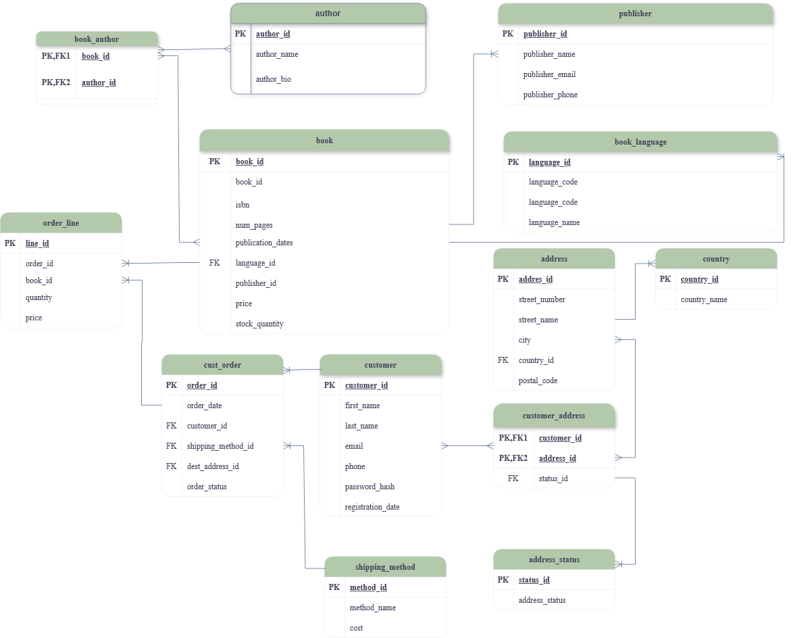

# Bookstore Database Project

Welcome to the `bookstore` database project! This database is the backbone of a modern, scalable, and efficient bookstore management system. It is designed to streamline operations, enhance customer experiences, and provide robust data insights for decision-making. Below, are the key features and benefits of this project.

---
The `bookstore` database is more than just a collection of tables—it's a comprehensive solution for managing a bookstore's operations. But

1. **Seamless Operations**  
   - Efficiently manage book inventory, customer data, and sales processes.
   - Support for complex relationships, such as books with multiple authors and customers with multiple addresses.

2. **Scalability and Growth**  
   - Built with scalability in mind, this database can grow as the business grows, handling increasing volumes of data and users.

3. **Data-Driven Decision Making**  
   - Role-based access ensures secure and accurate reporting for analytics and business insights.

4. **Security and Reliability**  
   - User roles and permissions are carefully designed to protect sensitive data while ensuring operational efficiency.
---

## Key Features

### 1. **Book Inventory Management**
   - Tracks essential book details: title, ISBN, price, stock quantity, and more.
   - Supports relationships between books and authors for a many-to-many association.

### 2. **Customer and Address Management**
   - Stores customer profiles, including names, contact details, and registration dates.
   - Manages multiple addresses per customer with status tracking.

### 3. **User Roles and Permissions**
   - **Admin Users**: Full control over the database for management and configuration.
   - **Application Users**: Day-to-day operational access for adding, updating, and deleting records.
   - **Reporting Users**: Read-only access for generating reports and analytics.

---

## Technical Overview

### Database Tables
The database consists of the following core tables:
- **Books**: Manages book details and inventory.
- **Authors**: Tracks authors and their relationships with books.
- **Customers**: Stores customer profiles and their associated addresses.
- **Addresses**: Manages address details linked to customers.
- **Relationships**: Supports many-to-many relationships between books/authors and customers/addresses.

### Security
- Role-based access ensures data security and operational efficiency.
- User accounts are created with specific privileges:
  - Admin: Full access.
  - Application: Read/write access.
  - Reporting: Read-only access.

---

## Entity-Relationship Diagram (ERD)

Below is the ERD for the `bookstore` database, showcasing the relationships between the tables:

## Database Schema

---

## How to Set Up

1. **Run the Script**  
   Execute the `bookstore.sql` script in your MySQL database to create the schema, tables, and user accounts.

2. **Connect to the Database**  
   Use the appropriate credentials based on your role:
   - Admin: Full control.
   - Application: Operational access.
   - Reporting: Read-only access.

3. **Start Using the Database**  
   Integrate the database with your application or use it for reporting and analytics.

---

## The Vision

This project is not just about managing a bookstore—it’s about redefining how bookstores operate in the digital age. With this database, you can:
- Expand your business with confidence, knowing your data infrastructure is robust and scalable.
- Deliver exceptional customer experiences by leveraging accurate and organized data.
- Make informed decisions with real-time insights and analytics.

---
[def]: ERD.drawio.png